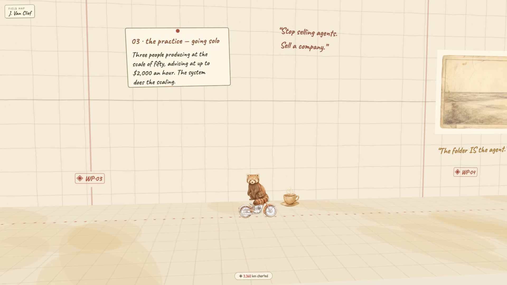

# The Cartographer's Desk

*A field map of Jake Van Clief — marine cryptographer → AI-governance researcher → solo operator.*

This is a hand-drawn expedition map you scroll **east** through. A fox cartographer travels
the route with you — riding a tank through the Corps years, flying over Edinburgh, then a
motorcycle into the solo-practice miles — passing six waypoints of a career, each pinned to
the map as a handwritten note card. The map loops: it is never finished, and neither is the work.

Built as a gift. Map your work — don't just store it.

▶ **[See it live](https://danneytrieu.github.io/cartographers-desk/)** — scroll the map in your browser.

## ▶ Make it your own — 2-minute tutorial

New here? Watch the walkthrough — swap the fox for your own traveler and put up your
own version, start to finish (narrated by Clio):

[](https://danneytrieu.github.io/cartographers-desk/demo/watch.html)

▶ **[Watch the walkthrough](https://danneytrieu.github.io/cartographers-desk/demo/watch.html)** (plays in your browser)

The exact prompts it uses live in [`prompts/`](prompts/): one shared **style block** plus a
short subject line per drawing — that's the whole consistency trick.

### …or let Claude build it for you

Open this folder in [Claude Code](https://claude.com/claude-code) and say
**"make this map mine."** It runs the bundled [`make-your-map`](.claude/skills/make-your-map/)
skill: it interviews you about your life in a handful of questions, rewrites
[`map.config.js`](map.config.js) with your chapters, helps you swap the artwork, and
deploys it to your own GitHub Pages. Prefer to do it by hand? The same steps are in
[`MAKE-YOUR-OWN.md`](MAKE-YOUR-OWN.md).

**The one file you edit is [`map.config.js`](map.config.js)** — the whole map as plain
data (name, chapters, notes, aphorisms, which art sits where). `index.html` is just the
engine; you never touch it.

## Run it

No build step, no dependencies at runtime — one HTML file plus painted PNG cutouts.

```bash
python3 -m http.server 8231
# → http://localhost:8231
```

Deep links: `?p=0.46` (or `#0`–`#7`) jump to a waypoint. Scroll, swipe, or arrow keys to travel.

## How it's built

**One engine, one config.** `index.html` is a single Three.js scene: a parchment "wall" with a
survey grid, a ground plane with the dotted route, and every drawing placed as a textured
plane. It reads its *content* — the name, the chapters, the note cards, the aphorisms, which
art sits where — from [`map.config.js`](map.config.js), so making the map about a different
person means editing that one data file, never the engine. A Catmull-Rom curve carries the
camera east; wheel/touch/keyboard events feed a virtual scroll target and the camera position
is damped toward it every frame
(`p += d * (1 − e^(−3.5·dt))`), which is what makes the travel feel like sliding a heavy
map drawer rather than stepping through slides.

**The world is painted, not styled.** All the artwork — terrain, vignettes, props, the fox
and his vehicles — is AI-generated watercolor, produced on a white background and then
**baked to true RGBA** with `bake_alpha.py`: alpha is recovered as `255 − min(r,g,b)` and
the color un-multiplied from white, which keeps the soft watercolor edges instead of the
hard halo you get from naive background removal. The code never fakes the look with CSS
filters or blend modes — the map look lives entirely in the paint.

One subtlety that bake taught us: global color-to-alpha also hollows out *interior*
whites — the fox's white chest became a window, and dark props behind him bled through.
`rematte.py` repairs that: only background *connected to the canvas border* stays
transparent, interior whites become opaque paint again, and a feathered rim keeps the
watercolor edge. The traveler sprites also render on their own top compositing layer
(`renderOrder` + no depth test), so the fox and his vehicles always pass *in front of*
the map, never through it.

**The traveler.** The fox is a small state machine driven by his position on the route:
vehicle windows along the x-axis swap him between *tank → plane → motorcycle → on foot*,
each with a perch offset tuned to the vehicle's silhouette. On foot and moving, a two-frame
trot cycle flips at 7 Hz; at rest he sits. The sitting and trotting sprites were scale-matched
against each other's alpha-channel geometry (head and satchel size), so he stays the same
fox whether he's moving or waiting for you.

**The seamless loop.** The opening panel is duplicated one full route-length east, and the
finale one length west; when progress wraps past 1.0 both the target and current positions
wrap together, so scrolling past FIN lands you back at the title with no visible seam.

**No mid-scroll hitches.** After the last texture loads, every scene is rendered once
off-screen *behind the loading overlay*, so all GPU texture uploads happen before the
map is revealed — first scroll is as smooth as the tenth.

**QA.** `verify.mjs` drives the real page headless (Playwright + Chromium): it seeks every
waypoint and screenshots it, asserts the fox's mode/scale/grounding at each stop, checks the
trot↔sit swap mid-scroll, and samples requestAnimationFrame deltas across a full route
travel to catch jank (the shipped build holds a steady frame time with zero spikes).

```bash
npm i playwright   # once
node verify.mjs    # server on :8231 required
```

## Files

| file | what it is |
|---|---|
| `map.config.js` | **the map as data** — name, chapters, notes, aphorisms, art placement. Edit this. |
| `index.html` | the engine — scene, travel, mascot logic, loop, QA hooks. Leave it alone. |
| `assets/*.png` | the painted world, baked to RGBA |
| `bake_alpha.py` | white-background → transparent-watercolor recipe |
| `rematte.py` | keeps interior whites opaque (border-connected matting) |
| `verify.mjs` | headless QA harness |
| `prompts/` | the art recipe — one style block + a subject line per plate |
| `.claude/skills/make-your-map/` | a Claude skill that builds your own map from an interview |
| `MAKE-YOUR-OWN.md` | the by-hand version of the same steps |

---

*Made with care (and a fox) by Danney Trieu, with Claude riding shotgun.*
